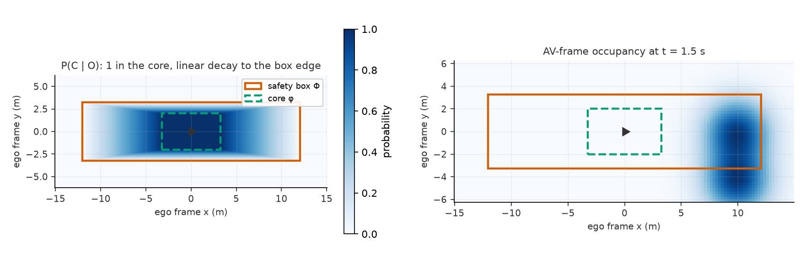
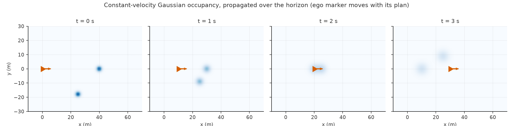
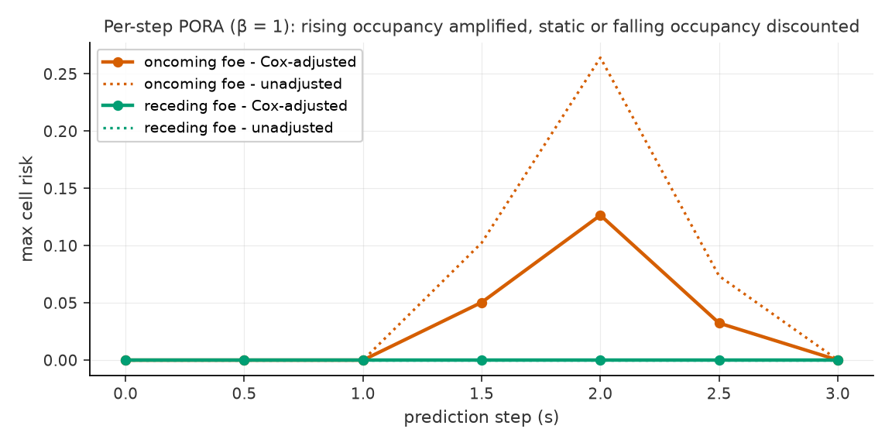

# pora-replication

[](https://github.com/chenggma/pora-replication/actions/workflows/tests.yml)

**Unofficial reimplementation of the PORA collision-risk metric.
I am not an author of the paper.** Everything here is written from the
public arXiv text:

> Wang, Yeo, Paiva, Utke, Delle Monache, *Dynamic Risk Assessment for
> Autonomous Vehicles from Spatio-Temporal Probabilistic Occupancy
> Heatmaps*, [arXiv:2501.16480](https://arxiv.org/abs/2501.16480).

**Disclosure.** I spent one semester (Sept-Dec 2025) as a student researcher
in the authors' lab, working in this area. This implementation was written
afterward, from the public arXiv text; I did not copy code, data, or
unpublished material from the lab. But I cannot claim to be a fully
independent replicator - I was in the room, and I cannot rule out that
unpublished context informs choices made here. Read this as a
*former-member* reimplementation, not an independent replication.

The paper states its official code will be released upon publication; when
it is, prefer it as the reference implementation. What this repository is
still good for is the places where the paper under-specifies itself (see the
gaps table below).

## Scope

The **metric** is the replication target, not the learned predictor. The
paper couples PORA to a transformer-encoder/GAN-decoder occupancy model;
this repository deliberately replaces that with transparent occupancy
sources (constant-velocity Gaussian propagation) so the metric's behavior
can be studied and benchmarked in isolation. Conclusions drawn with this
package speak to *the metric under a simple predictor*, not to the paper's
full system.

Implemented, mapping to the paper's pipeline:

| Stage | Module |
|---|---|
| Dynamic safety box Φ (SSD-sized) and guaranteed-collision subarea φ | `pora/geometry.py` |
| Global-to-AV-frame translate / rotate / resample | `pora/transform.py` |
| Conditional collision probability P(C\|O), cell-wise P(C) | `pora/risk.py` |
| Cox relative-motion adjustment and normalization | `pora/risk.py` |
| Per-step max aggregation and horizon scoring | `pora/risk.py` |
| Occupancy sources (constant-velocity Gaussian) | `pora/occupancy_sources.py` |
| TTC / TTS baselines the paper compares against | `pora/baselines.py` |

## The pipeline, in pictures



Left: the conditional collision probability field - 1 inside the core
rectangle, linear decay to the safety-box edge. Right: global occupancy
resampled into the ego frame at t = 1.5 s; the oncoming foe's probability
mass is entering the box's leading edge.





Every figure regenerates from the implementation alone:
`python figures/make_figures.py` (needs matplotlib).

## Reproducibility gaps

Places where the arXiv text does not pin down the computation, and the
choice made here. Every one of these is a parameter, so a different reading
of the paper is one argument away.

| Quantity | Paper | This implementation |
|---|---|---|
| Decay f between φ and Φ | "can be derived through calibration"; monotone toward the box edge | Linear decay of the nested-rectangle interpolation coordinate (`geometry.py`) |
| Cox coefficient β | Calibrated; value not disclosed | Parameter, default 1.0 |
| SSD reaction time | AASHTO form; constants ambiguous in the HTML rendering | Parameter, default 1.0 s (deceleration 9.81 m/s²) |
| Grid resolution | Not stated | Parameter, default 0.5 m |
| Aggregation across the K timesteps | Not stated | Both returned: per-step series and horizon max |
| Occupancy outside grid coverage | Not addressed | Treated as free (0) |

One consequence worth knowing: the paper's stated normalization
(dividing by e^β) means a *static* scene (ΔP = 0) scores e^-β lower than
the unadjusted collision probability; only a maximal occupancy increase
(ΔP = +1) preserves it. That is faithful to the text, not a bug - see
`tests/test_risk.py::TestCoxAdjust`.

## Quickstart

```python
from pora import (VehicleDims, SafetyBox, constant_velocity_gaussian,
                  to_av_frame, pora_horizon)
from pora.occupancy_sources import FoeState

foe = FoeState(x=40.0, y=0.0, vx=-10.0, vy=0.0, dims=VehicleDims(4.5, 2.0))
grids, boxes = [], []
for k in range(6):                      # 2.5 s horizon at 0.5 s steps
    t = 0.5 * k
    g = constant_velocity_gaussian([foe], lead_time=t, origin=(-10, -30),
                                   shape=(121, 161), resolution=0.5)
    box = SafetyBox(av=VehicleDims(4.5, 2.0), fleet_max_length=4.5,
                    fleet_min_width=2.0, speed_ms=10.0)
    grids.append(to_av_frame(g, av_x=10.0 * t, av_y=0.0, av_heading_rad=0.0,
                             half_length=box.phi_length / 2 + 2,
                             half_width=box.phi_width / 2 + 2))
    boxes.append(box)
print(pora_horizon(grids, boxes, beta=1.0).scalar)
```

## Does PORA actually beat TTC?

That question is out of scope here and answered empirically in the sibling
repository [risk-metric-bench](https://github.com/chenggma/risk-metric-bench),
which scores PORA, inverse TTC, and TTS margin on SUMO Monte Carlo
intersections with ground-truth collision labels.

## Tests

57 unit tests, including analytic cases for every formula above; CI runs
them on Python 3.9 and 3.12.

```
python -m unittest discover -s tests
```

## Citation

If you use this package, cite the paper (it is their method):

```bibtex
@article{wang2025pora,
  title={Dynamic Risk Assessment for Autonomous Vehicles from
         Spatio-Temporal Probabilistic Occupancy Heatmaps},
  author={Wang, Han and Yeo, Yuneil and Paiva, Antonio R. and Utke, Jean
          and Delle Monache, Maria Laura},
  journal={arXiv preprint arXiv:2501.16480},
  year={2025}
}
```

MIT license.
